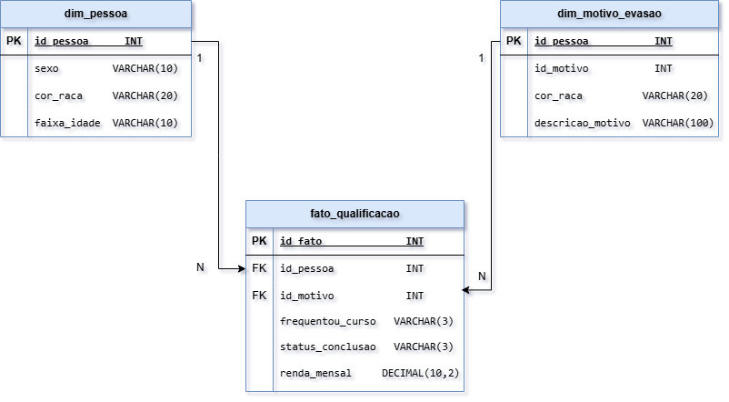
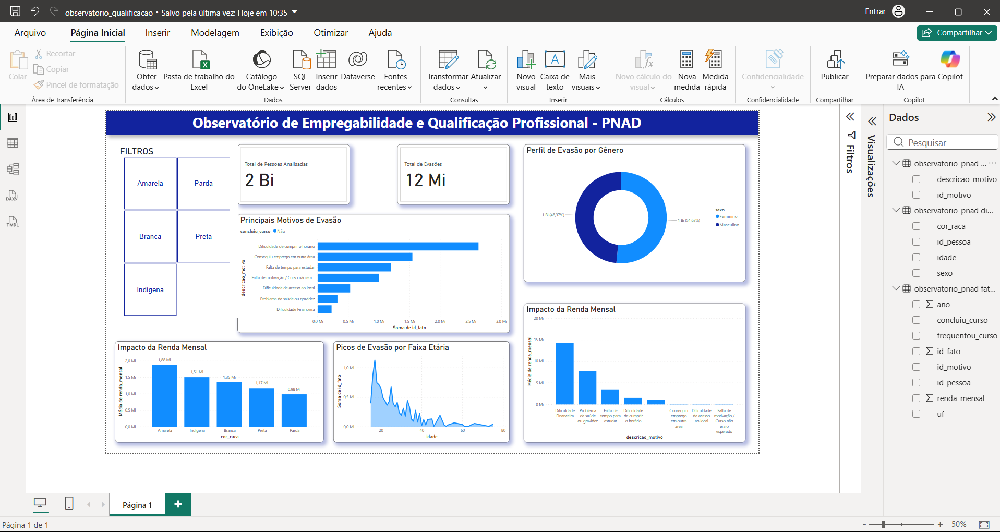

# ↪ Observatório de Qualificação Profissional e Empregabilidade

Este repositório contém o desenvolvimento do Projeto Integrador Extensionista em Ciência de Dados, focado em analisar os desafios e impactos da qualificação profissional no Brasil.

## ⩥ Sobre o Projeto
O projeto utiliza dados da pesquisa suplementar PNAD 2014 (IBGE) sobre Educação e Qualificação Profissional. O objetivo principal é atuar como um observatório, extraindo insights analíticos sobre os motivos de evasão em cursos profissionalizantes e o impacto dessa formação na renda familiar. O público-alvo são instituições de ensino e gestores de políticas públicas.

## ⩥ Fonte dos Dados
* **Origem:** Instituto Brasileiro de Geografia e Estatística (IBGE)
* **Base:** PNAD 2014 - Educação e Qualificação Profissional (Formato CSV).
* Os dados são de domínio público, anonimizados, respeitando as diretrizes éticas e a LGPD.

## ⩥ Tecnologias Utilizadas
* **Python (Pandas):** Para limpeza e transformação inicial dos dados.
* **MySQL:** Armazenamento estruturado e consultas (Queries) analíticas.
* **Ferramenta de BI:** Para visualização e apresentação dos KPIs.
* **GitHub & Trello:** Versionamento de código e gestão ágil (Kanban).

## ⩥ Fluxograma de Dados
Abaixo está o fluxo detalhado das etapas do nosso processamento de dados (ETL):


https://drive.google.com/file/d/1Os8qotCLdyhJQgHWvCH-_Itqn0AZSgjf/view?usp=sharing

## ⩥ Gestão Ágil (Kanban)
O acompanhamento de entregas, EAP e mitigação de riscos está sendo gerido via Trello. Segue o registro do board atual:


https://trello.com/invite/b/6a0f0536261037067da72fe3/ATTI181a38c54d26145b37073634376d658f4B595489/pi-extensionista-cd1
Data: 20/05 a 27/05

## ⩥ Arquitetura e Desenho da Solução
Durante a segunda etapa do projeto, definimos as regras de negócio e a modelagem dos dados:

* **Dicionário de Dados & Qualidade:** Regras de limpeza, tratamento de nulos e de outliers mapeadas para execução via Pandas.

* **Modelo Lógico:** Estruturação no MySQL utilizando Star Schema, com uma Tabela Fato (Fato_Qualificacao) e dimensões sociodemográficas e de motivos de evasão.

* **Visualização:** Wireframe desenhado focando na jornada do usuário para o Dashboard.
  

## ⩥ Fase 3 - Implementação: ETL, Banco de Dados e Dashboard
Nesta etapa final, realizamos o desenvolvimento técnico do pipeline completo, desde a extração do dado bruto até a construção da interface visual analítica:

* **Engenharia de Dados (Python & Pandas):** 
  * Desenvolvimento de script exploratório para realizar "engenharia reversa" nos dicionários do IBGE, mapeando as posições exatas dos microdados no arquivo binário.
  * Pipeline ETL criado com leitura posicional (`read_fwf`), garantindo a integridade dos dados (`to_numeric`), tradução das chaves do IBGE para texto amigável de negócio e filtragem do público-alvo. O processo gerou uma base massiva e tratada com muitos registros.

* **Data Warehouse (MySQL):**
  * Configuração avançada de infraestrutura local (ajustes de `max_execution_time` e memória no `php.ini` do XAMPP) para suportar a alta volumetria de ingestão.
  * Alimentação dos dados via `Staging Area` e distribuição para o Data Warehouse (Star Schema) através de comandos DML de agrupamento e cruzamento relacional (`INSERT INTO ... SELECT`, `LEFT JOIN`).

* **Dataviz, UI e UX (Power BI):**
  * Conexão direta com a base MySQL e estabelecimento automático de relacionamentos entre Fato e Dimensões.
  * O painel foi projetado com forte viés de UI/UX, assemelhando-se a uma aplicação web. Utilizando a paleta de cores institucional guiando a hierarquia visual.
  * **Métricas Apresentadas:** Cartões de KPI dinâmicos, ranking de evasão, distribuição demográfica por gênero e faixa etária, além do impacto financeiro detalhando a renda média por grupos, tudo integrado por segmentadores de dados dinâmicos em blocos.

  

## ⩥ Estrutura de Pastas
Para facilitar a navegação e reprodução, o repositório está organizado da seguinte forma:
```text
observatorio-empregabilidade-pnad/
├── data/
│   ├── raw/                 # Arquivos brutos (TXT do IBGE e Dicionário XLS)
│   └── processed/           # CSV gerado pelo script ETL pronto para banco
├── docs/                    # Documentação, diagramas Draw.io e imagens
├── scripts/
│   └── python/              # Scripts de Engenharia de Dados (detetive_dicionario.py, etl_pnad.py)
├── dashboard/               # Arquivo Power BI (.pbix) e prints do painel
└── README.md
```
## ⩥ Guia de Reprodução (Passo a Passo)
Siga as instruções abaixo para recriar o pipeline de dados e visualizar o dashboard localmente.

### 1. Preparação do Ambiente Python
Certifique-se de ter o Python instalado. No terminal, instale as bibliotecas necessárias:
> pip install pandas xlrd

*Observação:* Coloque o arquivo bruto da PNAD 2014 (`pnad_2014_raw.txt`) e o dicionário (`dicionario_pnad.xls`) dentro da pasta `data/raw/`.

### 2. Execução do Processo ETL
Navegue até a pasta de scripts e rode o código de tratamento:
> cd scripts/python
> python etl_pnad.py

Isso gerará o arquivo limpo e estruturado `pnad_tratada.csv` na pasta `data/processed/`.

### 3. Configuração do Servidor Local (XAMPP/MySQL)
Devido ao alto volume de dados (mais de 213 mil linhas), é necessário preparar o servidor:
1. Abra o painel do XAMPP, vá nas configurações do Apache (`php.ini`).
2. Altere a linha `max_execution_time` para `3000`.
3. Salve e reinicie os serviços do Apache e MySQL.
4. Acesse o phpMyAdmin, crie o banco de dados `observatorio_pnad` e crie as tabelas do Modelo Estrela (Dimensões e Fato) juntamente com a tabela temporária `pnad_staging`.

### 4. Ingestão e Distribuição no Banco de Dados
1. No phpMyAdmin, importe o arquivo `pnad_tratada.csv` diretamente para a tabela `pnad_staging`.
2. Rode o script SQL abaixo para popular o Data Warehouse de forma inteligente:

> INSERT INTO Dim_Pessoa (sexo, cor_raca, idade)
> SELECT DISTINCT sexo, cor_raca, idade FROM pnad_staging;
> 
> INSERT INTO Dim_Motivo_Evasao (descricao_motivo)
> SELECT DISTINCT motivo_evasao FROM pnad_staging WHERE motivo_evasao IS NOT NULL;
> 
> INSERT INTO Fato_Qualificacao (id_pessoa, id_motivo, ano, uf, renda_mensal, frequentou_curso, concluiu_curso)
> SELECT p.id_pessoa, m.id_motivo, s.ano, s.uf, s.renda_mensal, s.frequentou_curso, s.concluiu_curso
> FROM pnad_staging s
> LEFT JOIN Dim_Pessoa p ON s.sexo = p.sexo AND s.cor_raca = p.cor_raca AND s.idade = p.idade
> LEFT JOIN Dim_Motivo_Evasao m ON s.motivo_evasao = m.descricao_motivo;

### 5. Conexão com o Power BI
1. Abra o arquivo `.pbix` localizado na pasta `dashboard/`.
2. Caso o Power BI solicite atualização da base, vá em "Obter Dados" > "MySQL".
3. Insira o servidor como `localhost` e o banco como `observatorio_pnad`.
4. Utilize as credenciais padrão do localhost (Usuário: `root` e senha em branco).
5. Carregue as tabelas e o Dashboard refletirá imediatamente os dados com todos os visuais e filtros.

## ⩥ Escopo e Entregas (Fase 1)
- [x] Termo de Abertura e Briefing.
- [x] Definição das Perguntas Analíticas e KPIs.
- [x] EAP, Matriz de Riscos e Cronograma.
- [x] Estruturação inicial do GitHub.

## ⩥ Fase 2 - Desenho da Solução
- [x] Dicionário de Dados (versão 1).
- [x] Modelo Lógico (Diagrama de tabelas e relacionamentos).
- [x] Plano de Qualidade de Dados (Checagens Python/MySQL).
- [x] Plano de Análise e Esboço (Wireframe) do Dashboard.
- [x] Criação de Issues (tarefas de desenvolvimento) no GitHub.

## ⩥ Fase 3 - Implementação e Entregas Finais
- [x] Script Python para mapeamento e extração de posições do Dicionário.
- [x] ETL concluído e geração da base tratada (213k+ linhas processadas).
- [x] Configuração de servidor e ingestão definitiva no BD (Modelo Estrela).
- [x] Desenvolvimento UI/UX e integração final do Dashboard no Power BI.
