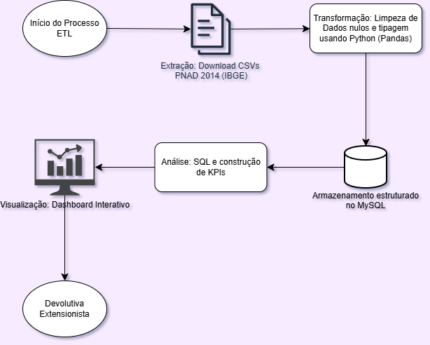
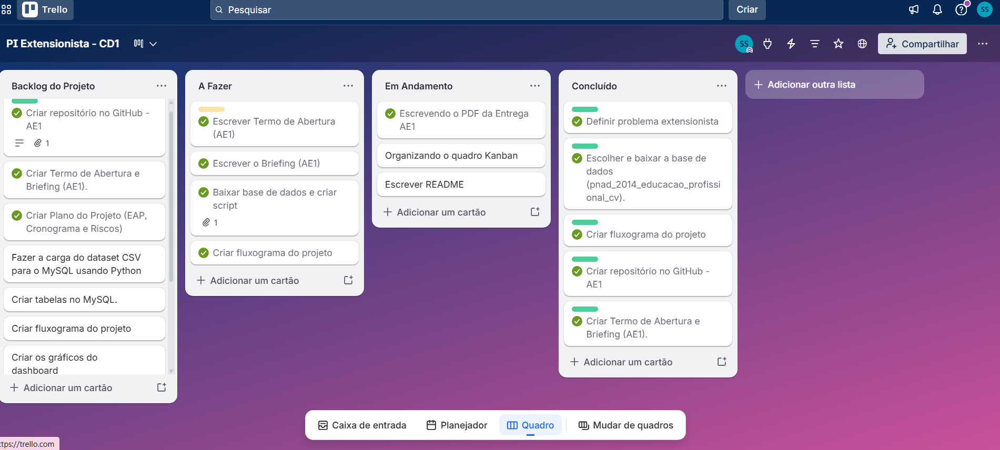

# ↪ Observatório de Qualificação Profissional e Empregabilidade

Este repositório contém o desenvolvimento do Projeto Integrador Extensionista em Ciência de Dados, focado em analisar os desafios e impactos da qualificação profissional no Brasil.

## ⩥ Sobre o Projeto
O projeto utiliza dados da pesquisa suplementar PNAD 2014 (IBGE) sobre Educação e Qualificação Profissional. O objetivo principal é atuar como um observatório, extraindo insights analíticos sobre os motivos de evasão em cursos profissionalizantes e o impacto dessa formação na renda familiar. O público-alvo são instituições de ensino e gestores de políticas públicas.

## ⩥ Fonte dos Dados
* **Origem:** Instituto Brasileiro de Geografia e Estatística (IBGE)
* **Base:** PNAD 2014 - Educação e Qualificação Profissional (Formato CSV).
* Os dados são de domínio público, anonimizados, respeitando as diretrizes éticas e a LGPD.

## ⩥ Tecnologias Utilizadas
* **Python (Pandas):** Para limpeza e transformação inicial dos dados.
* **MySQL:** Armazenamento estruturado e consultas (Queries) analíticas.
* **Ferramenta de BI:** Para visualização e apresentação dos KPIs.
* **GitHub & Trello:** Versionamento de código e gestão ágil (Kanban).

## ⩥ Fluxograma de Dados
Abaixo está o fluxo detalhado das etapas do nosso processamento de dados (ETL):

https://drive.google.com/file/d/1Os8qotCLdyhJQgHWvCH-_Itqn0AZSgjf/view?usp=sharing

## ⩥ Gestão Ágil (Kanban)
O acompanhamento de entregas, EAP e mitigação de riscos está sendo gerido via Trello. Segue o registro do board atual:

https://trello.com/invite/b/6a0f0536261037067da72fe3/ATTI181a38c54d26145b37073634376d658f4B595489/pi-extensionista-cd1
Data: 20/05 a 27/05

## ⩥ Escopo e Entregas (Fase 1)
- [x] Termo de Abertura e Briefing.
- [x] Definição das Perguntas Analíticas e KPIs.
- [x] EAP, Matriz de Riscos e Cronograma.
- [x] Estruturação inicial do GitHub.

